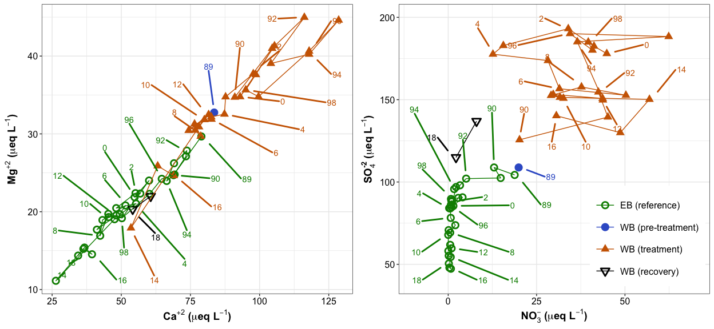
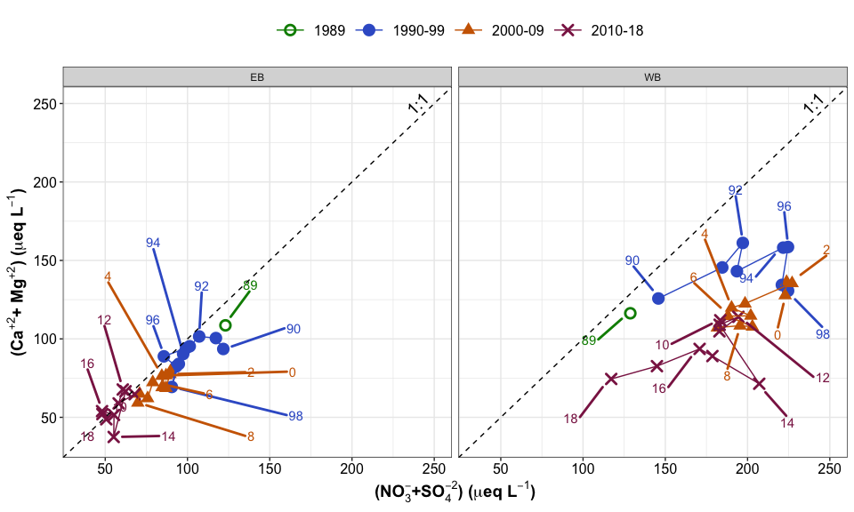
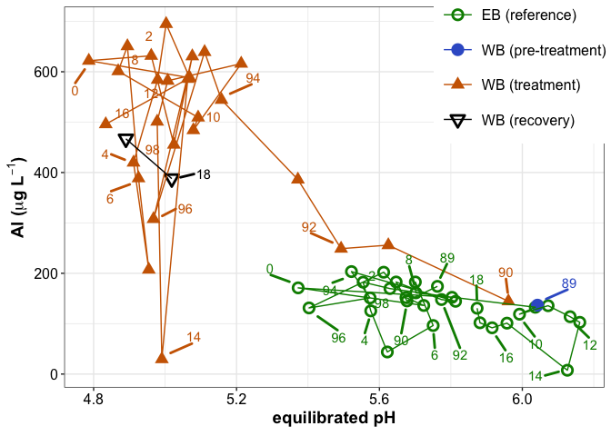
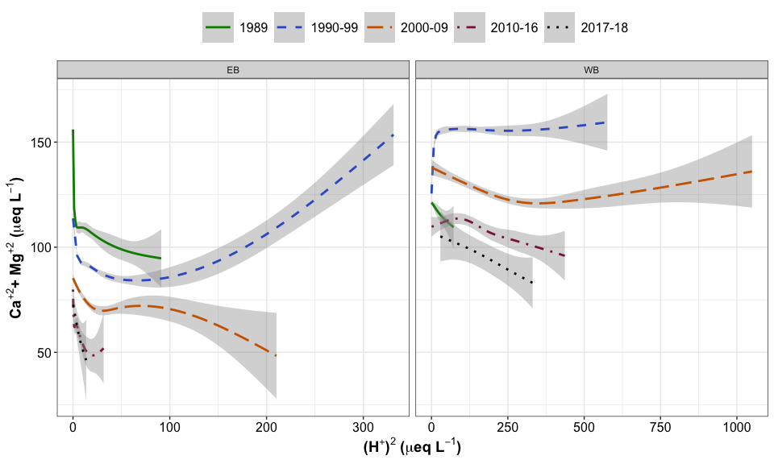
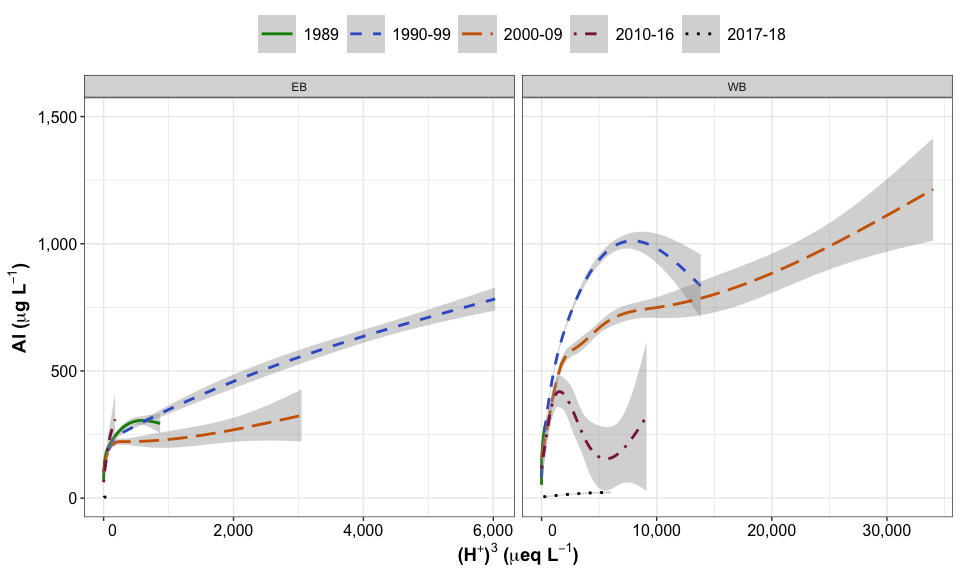

BBWM stream recovery (SFS 2019)
================

**Figures presented at the 2019 meeting of the Society of Freshwater
Science.**

Fernandez, I. J., Norton, S. A., Nelson, S. J., and Patel, K., 2019,
Trajectories of recovery from acid rain over 31 years (ambient) and 2
years (experimental) at the Bear Brook Watershed in Maine (BBWM), USA
(oral): Annual meeting of the Society of Freshwater Science, Salt Lake
City, Utah.

-----

The Bear Brook Watershed in Maine (BBWM) is a paired-watershed whole
ecosystem experiment. Two nearly perennial streams drain two contiguous
watersheds, West Bear (WB) and East Bear (EB). Stream discharge has been
monitored every 15 minutes from 1987 to 2018. Stream chemistry has been
evaluated by analysis of ISCO and grab samples during the same period.
Samples numbers for each stream in the calibration period (1987-1989)
ranged up to 250 per year. Frequency of samples declined to as few as 25
per year in the late stages of the investigation. WB was treated with
(NH4)2SO4 from 1989 to 2016, and then allowed to recover. EB has been
recovering from acid rain since before 1987, due to implementation of
the U. S. Clean Air Act of 1970 and subsequent amendments.

Since 1980, wet deposition of SO4 to central Maine declined almost
linearly from ca. 30 µeq/L to 5 µeq/L by 2017 (NADP) (Fig.4). Nitrate
has declined from ca. 12 µeq/L to 8 µeq/L, mostly in the last 10 years.
Recovery trajectories for metals in EB are largely related to the
decline of SO4, and earlier soil acidification. West Bear trajectories
involved a decline in ambient SO4 deposition as well as the termination
of treatment, which added SO4 and NO3.

-----

<!-- -->

-----

In EB, Ca and Mg declined more than SO4 and NO3 from 1987 to about 2010,
causing a pH lower than the 1987-1989 calibration period, a trajectory
related to recovery of soil base saturation. The pH is now increasing as
Ca and Mg continue to recover, a consequence of restoration of base
saturation from chemical weathering. NO3 declined virtually to detection
by 1990 where it has remained, while SO4 declined due to declining
atmospheric deposition, with flux out of the watershed exceeding the wet
atmospheric flux for the entire period of record.

For WB, likely recovering in parallel to EB until 1989, the treatment
with (NH4)2SO4) reversed the declining trajectory of Ca and Mg and Ca
and Mg increased until about 1995, stalled, and then slowly and
irregularly declined until 1998-2000, where Ca and Mg increased slightly
as a consequence of a severe ice storm, canopy damage, and increased
degrading biomass on the forest floor. The Ca and Mg resumed an
irregular decline until the end of the treatment and then declined
rapidly in the recovery period (2017-2018). NO3 and SO4 responded
immediately to the treatment by increasing dramatically, but never to
the point where both NO3 and SO4 were not being retained by the
watershed. SO4 started declining during the last four years of
treatment, as a consequence of the declining ambient deposition. At the
cessation of the treatment, previously elevated NO3 dropped nearly to
zero, while SO4 declined almost to values prior to the treatment (1989).

The year 2014 was relatively dry and fewer samples were taken. The
chemistry of 2014 was unusual in both catchments.

<!-- -->

(The sum of base cations) minus (the sum of strong acids) is a measure
of the acidity of a solution. If negative, the ANC is negative. As the
difference grows, ANC becomes more negative and pH declines. For both EB
and WB, the major cations are Ca, Mg, Na, and K. Na is almost balanced
by Cl, with a small contribution from weathering. K is typically \< 5-6
µeq/L and varies only a few µeq/L through the year. Thus, we can use,
as an approximation of the acidity of a system, (Ca + Mg) – (SO4 + NO3).

In EB, (Ca + Mg) declined more than (SO4 + NO3) from 1989 to about 2010,
causing a pH lower than the 1987-1989 calibration period (Fig. 8), a
trajectory related to recovery of soil base saturation. The pH is now
increasing as (Ca + Mg) continue to recover, a consequence of
restoration of base saturation from chemical weathering. In WB, (Ca +
Mg) increased dramatically during the initial years of treatment, and
(SO4 + NO3) increased more than (Ca + Mg), driving the data away from
the 1:1 line, the consequence of increasing acidity. As Ca and Mg became
depleted in the soil exchange complex and SO4 started to decline because
of declining atmospheric deposition of SO4, the annual data slid
clockwise on Figure 8, back toward the 1:1 line, and accelerated during
the two-year recovery period after treatment ceased. (Ca + Mg) and (SO4
+ NO3) in 2018 were lower than the initial values in 1989. The recovery
in WB will likely follow a path similar to that of EB, but retarded by
years.

-----

The consequence of the lower ANC and pH in WB was an immediate increase
in dissolved Al (Figure 10) to annual values mostly in excess of 400
µg/L, while EB Al remained at 200 µg/L or less. As pH has risen in EB,
Al has declined. From 1994 to 2018, the pH of WB averaged approximately
4.9 and Al averaged 500 µg/L.

### AL vs. pH

<!-- -->

## Ca-Mg-Al vs. H

The next two graphics suggest that there is a mechanistic relationship
between (Ca + Mg) and Al in runoff, and (H+)2 and (H+)3, respectively.

These relationships would be of the type:

2H+ + (Ca+2-Soil) → Ca+2 + (H+2-Soil), and 3H+ + (Al+3- Soil) → Al3+ +
(H+3-Soil)

The exchange equilibria are of the form: K =
\[(Ca+2)/(H+)2\]/\[(Ca+2-Soil)/(H+2-Soil)\]

For the short term, \[(Ca+2-Soil)/(H+2-Soil)\] is constant at a given
point in the soil. The equation reduces to:

K’ = \[(Ca+2)/(H+)2\]. The curvature of the statistical curves is caused
by the non-constant \[(Ca+2-Soil)/(H+2-Soil)\] term at different points
along the flow paths.

Figures 16 and 17 show similarities to Figures 13 and 14. EB shows
continuing depletion of Ca and Al in runoff as a consequence of
adsorption, and adsorption and/or lower solubility of Al(OH)3,
respectively, through time during continuous recovery. WB shows the
initial flush of Ca + Mg with high H+. This is followed by Ca and Mg
depletion in the soils, transitioning into less adsorption in the two
year recovery. Al in WB is higher in the first decade of the treatment,
and then declines with time. This is likely a combination of decreasing
acidity, and decreasing desorption with a transitioning into adsorption.
The decline in time for equal pH may also be a sign of decreasing
solubility of Al(OH)3.

<!-- -->

<!-- -->

-----

## Conclusions

Deposition of SO4 has declined -0.65 µeq L-1 yr-1 since the 1970s.
Stream SO4 in EB has declined 65 µeq L-1 from 105 µeq L-1 since 1987,
and WB has declined 20 µeq L-1 during 2017-2018. Stream Ca+Mg, during
recovery in EB, declined nearly linearly from 105 to 35 µeq L-1 before
reversing. In WB during treatment, Ca+Mg increased from 108 to 170 µeq
L-1, dropped to 95 µeq L-1 still during treatment, and then dropped to
75 µeq L-1 during recovery from treatment plus ambient decline of SO4.
EB Al remained ≤ 200 µg L-1 while WB was always \> 200 µg L-1,except
2014. Ca and Mg declined with time along constant discharge flow paths
(soil adsorption) for EB, while WB initially increased export of Ca and
Mg until declining SO4 caused adsorption of Ca and Mg, starting in the
late 1990s. (Ca+Mg) and Al are related to (H+)2 and (H+)3, respectively,
suggesting decreasing mobilization of (Ca+Mg) by desorption, and Al by
desorption and possibly lower solubility of Al(OH)3.

-----

## Session Info

Date run: 2020-06-21

    #> R version 3.6.0 (2019-04-26)
    #> Platform: x86_64-apple-darwin15.6.0 (64-bit)
    #> Running under: macOS Mojave 10.14.6
    #> 
    #> Matrix products: default
    #> BLAS:   /Library/Frameworks/R.framework/Versions/3.6/Resources/lib/libRblas.0.dylib
    #> LAPACK: /Library/Frameworks/R.framework/Versions/3.6/Resources/lib/libRlapack.dylib
    #> 
    #> locale:
    #> [1] en_US.UTF-8/en_US.UTF-8/en_US.UTF-8/C/en_US.UTF-8/en_US.UTF-8
    #> 
    #> attached base packages:
    #> [1] stats     graphics  grDevices utils     datasets  methods   base     
    #> 
    #> other attached packages:
    #>  [1] scales_1.0.0    cowplot_1.0.0   ggrepel_0.8.1   forcats_0.5.0  
    #>  [5] stringr_1.4.0   dplyr_1.0.0     purrr_0.3.4     readr_1.3.1    
    #>  [9] tidyr_1.1.0     tibble_3.0.1    ggplot2_3.3.0   tidyverse_1.3.0
    #> 
    #> loaded via a namespace (and not attached):
    #>  [1] tidyselect_1.1.0 xfun_0.10        splines_3.6.0    haven_2.2.0     
    #>  [5] lattice_0.20-38  colorspace_1.4-1 vctrs_0.3.0      generics_0.0.2  
    #>  [9] htmltools_0.4.0  mgcv_1.8-29      yaml_2.2.0       blob_1.2.1      
    #> [13] rlang_0.4.6      pillar_1.4.4     glue_1.4.0       withr_2.1.2     
    #> [17] DBI_1.0.0        dbplyr_1.4.4     modelr_0.1.5     readxl_1.3.1    
    #> [21] lifecycle_0.2.0  munsell_0.5.0    gtable_0.3.0     cellranger_1.1.0
    #> [25] rvest_0.3.5      evaluate_0.14    labeling_0.3     knitr_1.25      
    #> [29] fansi_0.4.0      broom_0.5.6      Rcpp_1.0.2       backports_1.1.5 
    #> [33] jsonlite_1.6.1   fs_1.3.1         hms_0.5.3        digest_0.6.25   
    #> [37] stringi_1.4.3    grid_3.6.0       cli_2.0.2        tools_3.6.0     
    #> [41] magrittr_1.5     crayon_1.3.4     pkgconfig_2.0.3  Matrix_1.2-18   
    #> [45] ellipsis_0.3.0   xml2_1.2.2       reprex_0.3.0     lubridate_1.7.8 
    #> [49] assertthat_0.2.1 rmarkdown_2.1    httr_1.4.1       rstudioapi_0.11 
    #> [53] R6_2.4.0         nlme_3.1-141     compiler_3.6.0
