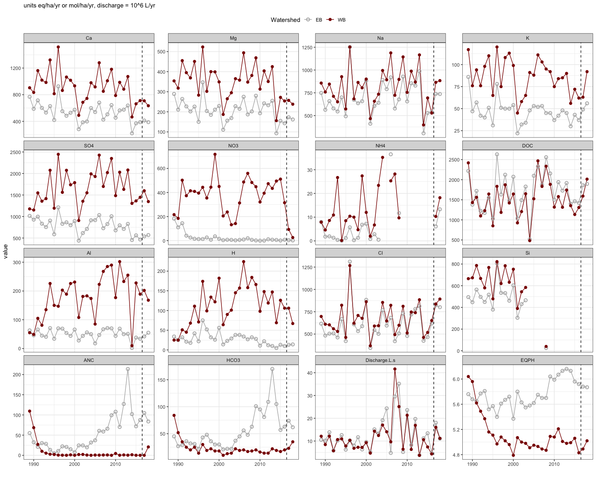
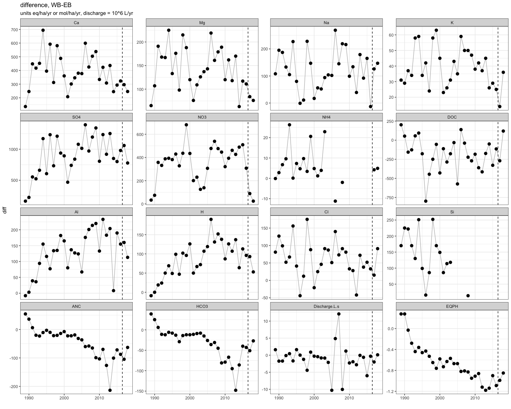
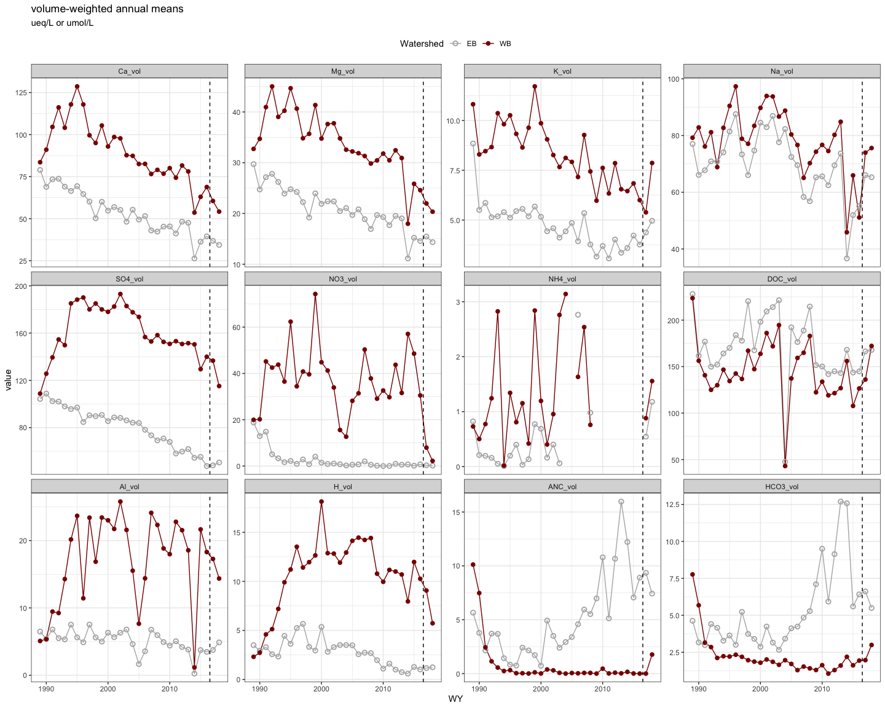
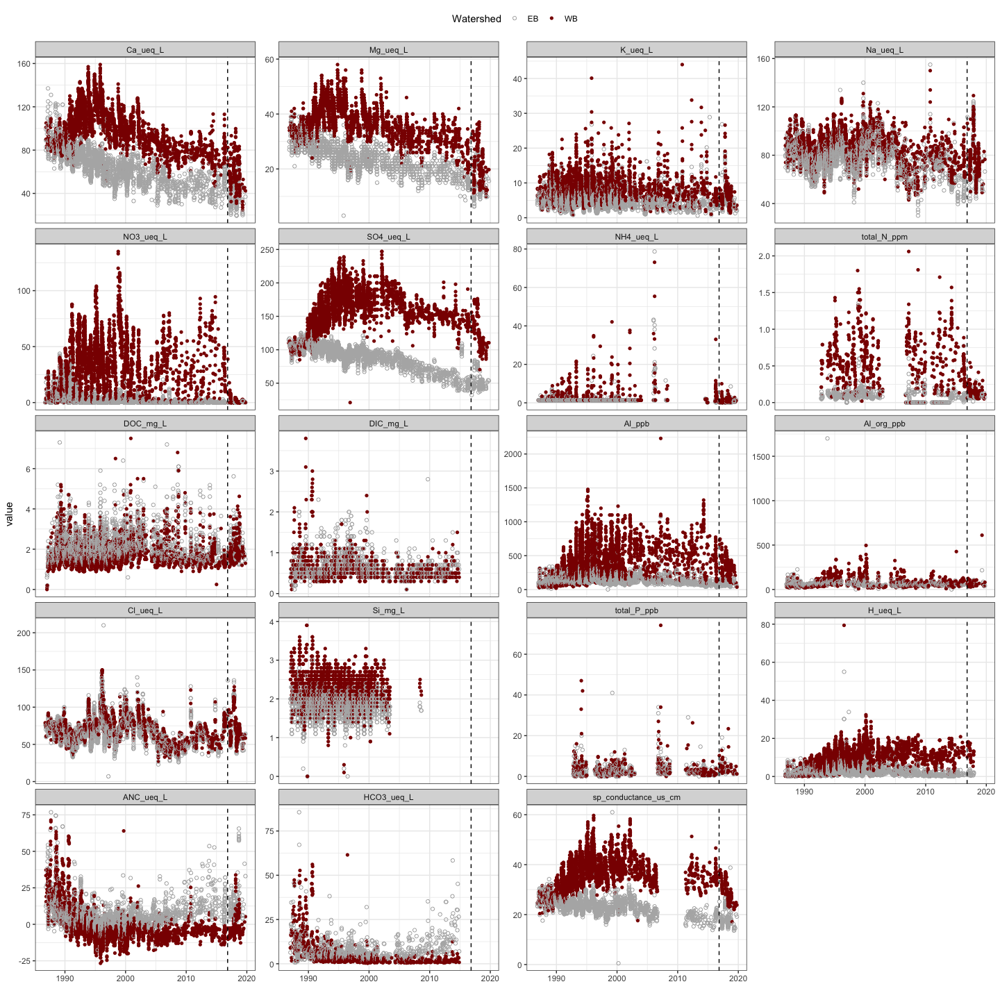
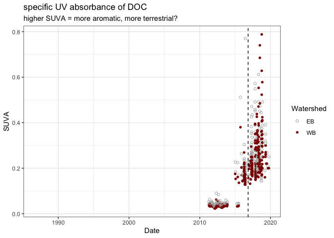
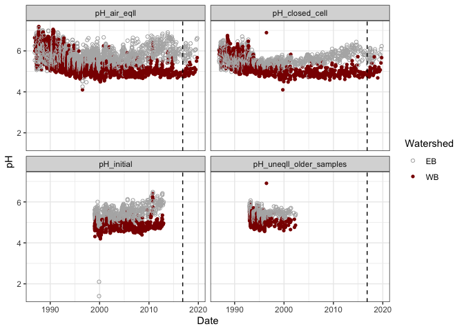
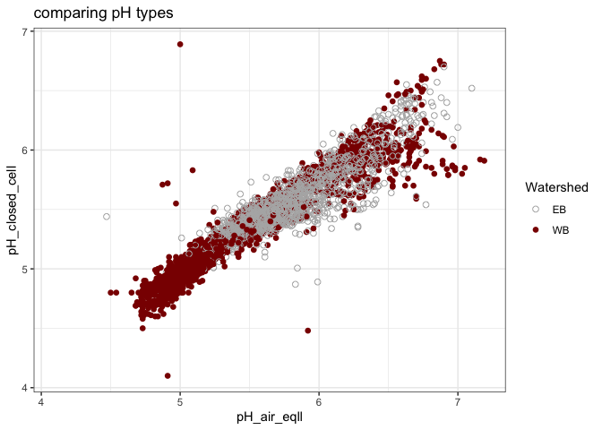
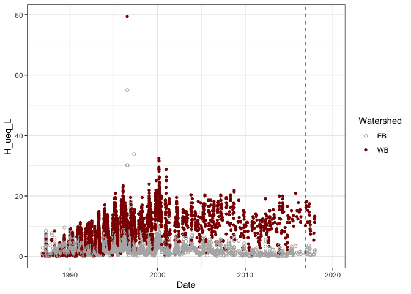

streams
================

These are preliminary graphs of stream chemistry.  
Additional figures, presented at the 2019 SFS conference, can be found
[here](https://github.com/kaizadp/bbwm_recovery_cations/blob/master/sfs2019/sfs2019_graphs.md).

-----

### ANNUAL EXPORTS

<!-- -->

#### annual exports – difference plots

<!-- -->

-----

### MEAN ANNUAL CONCENTRATIONS – VOLUME WEIGHTED

<!-- -->

-----

## TIME-SERIES STREAM CONCENTRATIONS (all data)

<!-- -->

-----

### DOC-SUVA (specific UV ansorbance)

<!-- -->

### pH – so many pHs\!

<!-- -->

<!-- -->

<!-- -->

-----

**Session Info**  
Date run: 2020-06-21

    #> R version 3.6.0 (2019-04-26)
    #> Platform: x86_64-apple-darwin15.6.0 (64-bit)
    #> Running under: macOS Mojave 10.14.6
    #> 
    #> Matrix products: default
    #> BLAS:   /Library/Frameworks/R.framework/Versions/3.6/Resources/lib/libRblas.0.dylib
    #> LAPACK: /Library/Frameworks/R.framework/Versions/3.6/Resources/lib/libRlapack.dylib
    #> 
    #> locale:
    #> [1] en_US.UTF-8/en_US.UTF-8/en_US.UTF-8/C/en_US.UTF-8/en_US.UTF-8
    #> 
    #> attached base packages:
    #> [1] stats     graphics  grDevices utils     datasets  methods   base     
    #> 
    #> other attached packages:
    #>  [1] ggalt_0.4.0        soilpalettes_0.1.0 lubridate_1.7.8   
    #>  [4] forcats_0.5.0      stringr_1.4.0      dplyr_1.0.0       
    #>  [7] purrr_0.3.4        readr_1.3.1        tidyr_1.1.0       
    #> [10] tibble_3.0.1       ggplot2_3.3.0      tidyverse_1.3.0   
    #> 
    #> loaded via a namespace (and not attached):
    #>  [1] Rcpp_1.0.2         lattice_0.20-38    assertthat_0.2.1  
    #>  [4] digest_0.6.25      proj4_1.0-8.1      R6_2.4.0          
    #>  [7] cellranger_1.1.0   backports_1.1.5    reprex_0.3.0      
    #> [10] evaluate_0.14      httr_1.4.1         pillar_1.4.4      
    #> [13] rlang_0.4.6        readxl_1.3.1       rstudioapi_0.11   
    #> [16] extrafontdb_1.0    blob_1.2.1         rmarkdown_2.1     
    #> [19] labeling_0.3       extrafont_0.17     munsell_0.5.0     
    #> [22] broom_0.5.6        compiler_3.6.0     modelr_0.1.5      
    #> [25] xfun_0.10          pkgconfig_2.0.3    htmltools_0.4.0   
    #> [28] tidyselect_1.1.0   fansi_0.4.0        crayon_1.3.4      
    #> [31] dbplyr_1.4.4       withr_2.1.2        MASS_7.3-51.4     
    #> [34] grid_3.6.0         nlme_3.1-141       jsonlite_1.6.1    
    #> [37] Rttf2pt1_1.3.7     gtable_0.3.0       lifecycle_0.2.0   
    #> [40] DBI_1.0.0          magrittr_1.5       scales_1.0.0      
    #> [43] KernSmooth_2.23-16 cli_2.0.2          stringi_1.4.3     
    #> [46] fs_1.3.1           xml2_1.2.2         ellipsis_0.3.0    
    #> [49] generics_0.0.2     vctrs_0.3.0        ash_1.0-15        
    #> [52] RColorBrewer_1.1-2 tools_3.6.0        glue_1.4.0        
    #> [55] maps_3.3.0         hms_0.5.3          yaml_2.2.0        
    #> [58] colorspace_1.4-1   rvest_0.3.5        knitr_1.25        
    #> [61] haven_2.2.0
