streams
================

These are preliminary graphs of stream chemistry.  
Additional figures, presented at the 2019 SFS conference, can be found
[here](https://github.com/kaizadp/bbwm_recovery_cations/blob/master/sfs2019/sfs2019_graphs.md).

## all time series

<!-- -->

-----

### base cations

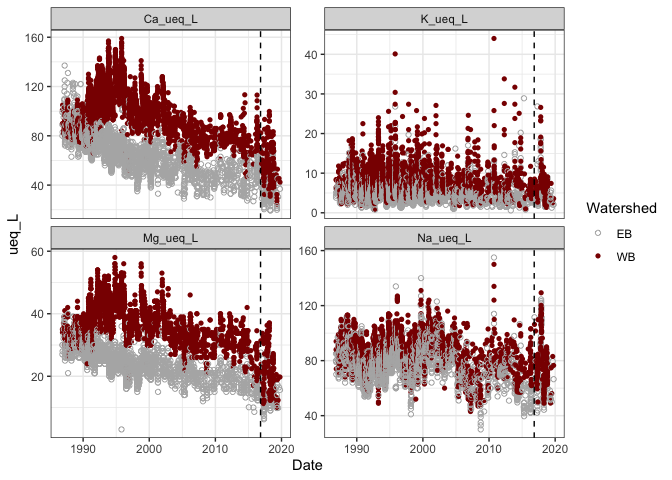<!-- -->

### acid anions

<!-- -->

### DOC

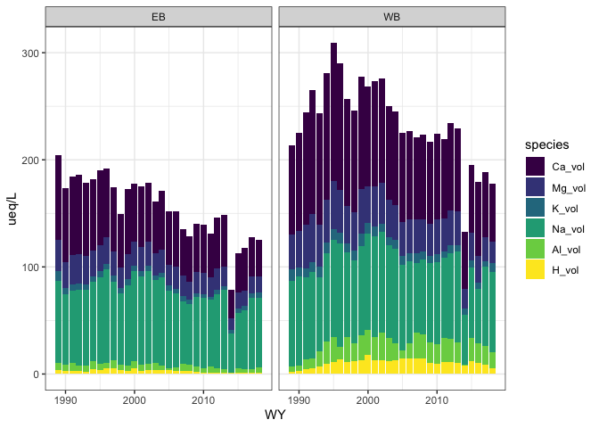<!-- -->

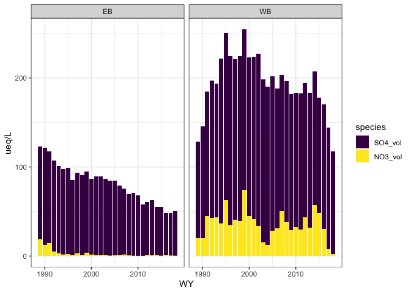<!-- -->

### aluminum

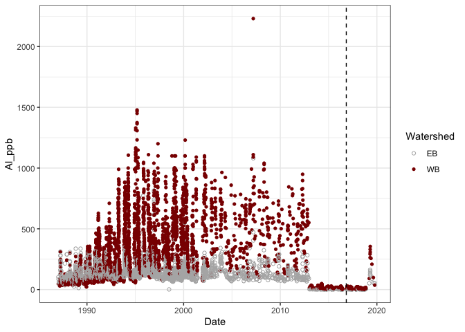<!-- -->

<!-- -->

### pH – so many pHs\!

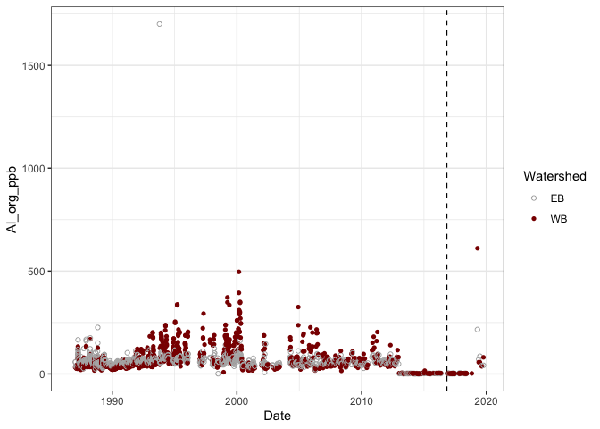<!-- -->

<!-- -->

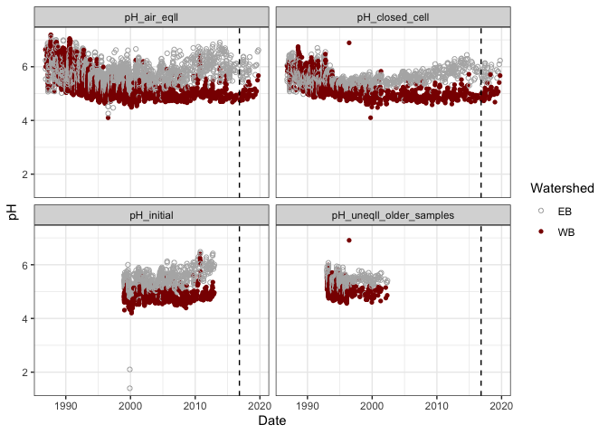<!-- -->

### others

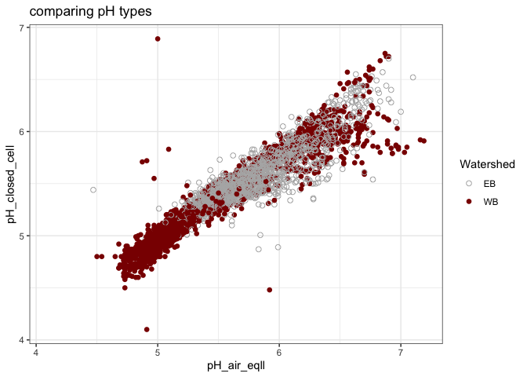<!-- -->

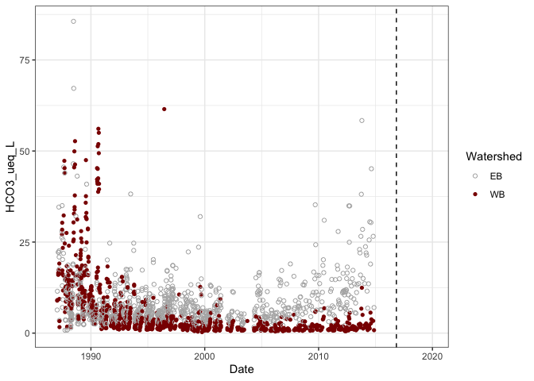<!-- -->

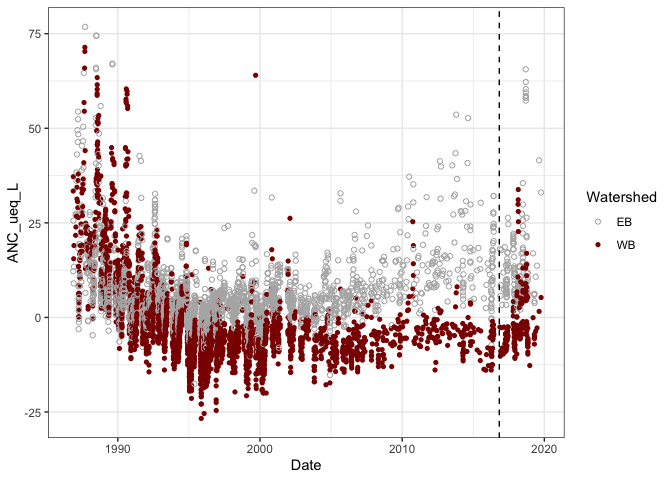<!-- -->

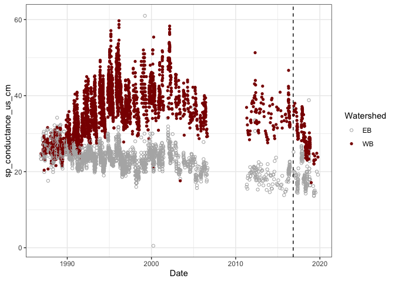<!-- -->

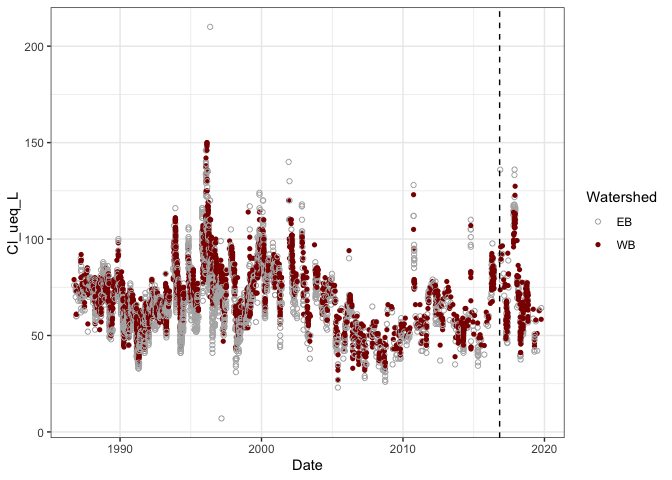<!-- -->

-----

**Session Info**  
Date run: 2020-06-21

    #> R version 3.6.0 (2019-04-26)
    #> Platform: x86_64-apple-darwin15.6.0 (64-bit)
    #> Running under: macOS Mojave 10.14.6
    #> 
    #> Matrix products: default
    #> BLAS:   /Library/Frameworks/R.framework/Versions/3.6/Resources/lib/libRblas.0.dylib
    #> LAPACK: /Library/Frameworks/R.framework/Versions/3.6/Resources/lib/libRlapack.dylib
    #> 
    #> locale:
    #> [1] en_US.UTF-8/en_US.UTF-8/en_US.UTF-8/C/en_US.UTF-8/en_US.UTF-8
    #> 
    #> attached base packages:
    #> [1] stats     graphics  grDevices utils     datasets  methods   base     
    #> 
    #> other attached packages:
    #>  [1] soilpalettes_0.1.0 lubridate_1.7.8    forcats_0.5.0     
    #>  [4] stringr_1.4.0      dplyr_1.0.0        purrr_0.3.4       
    #>  [7] readr_1.3.1        tidyr_1.1.0        tibble_3.0.1      
    #> [10] ggplot2_3.3.0      tidyverse_1.3.0   
    #> 
    #> loaded via a namespace (and not attached):
    #>  [1] tidyselect_1.1.0 xfun_0.10        haven_2.2.0      lattice_0.20-38 
    #>  [5] colorspace_1.4-1 vctrs_0.3.0      generics_0.0.2   htmltools_0.4.0 
    #>  [9] yaml_2.2.0       blob_1.2.1       rlang_0.4.6      pillar_1.4.4    
    #> [13] glue_1.4.0       withr_2.1.2      DBI_1.0.0        dbplyr_1.4.4    
    #> [17] modelr_0.1.5     readxl_1.3.1     lifecycle_0.2.0  munsell_0.5.0   
    #> [21] gtable_0.3.0     cellranger_1.1.0 rvest_0.3.5      evaluate_0.14   
    #> [25] labeling_0.3     knitr_1.25       fansi_0.4.0      broom_0.5.6     
    #> [29] Rcpp_1.0.2       scales_1.0.0     backports_1.1.5  jsonlite_1.6.1  
    #> [33] fs_1.3.1         hms_0.5.3        digest_0.6.25    stringi_1.4.3   
    #> [37] grid_3.6.0       cli_2.0.2        tools_3.6.0      magrittr_1.5    
    #> [41] crayon_1.3.4     pkgconfig_2.0.3  ellipsis_0.3.0   xml2_1.2.2      
    #> [45] reprex_0.3.0     assertthat_0.2.1 rmarkdown_2.1    httr_1.4.1      
    #> [49] rstudioapi_0.11  R6_2.4.0         nlme_3.1-141     compiler_3.6.0
